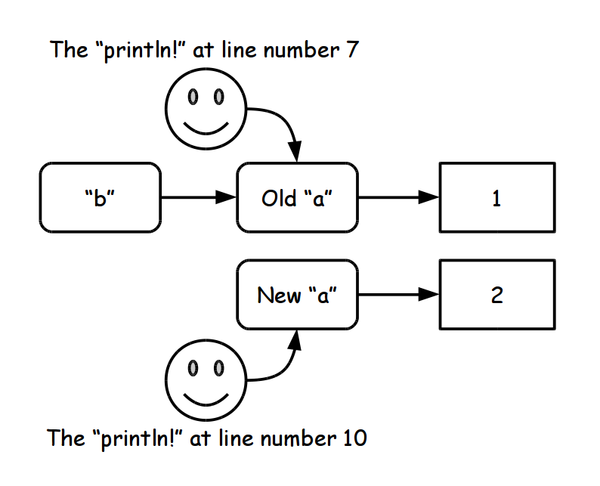

===================
Constant definition
===================

Constant (immutable) variable
=============================

Constant variable can be defined following:

.. literalinclude:: code/constant_var_definition/val_pi.dats
   :language: ocaml
   :linenos:

.. literalinclude:: code/constant_var_definition/val_pi_compile.txt
   :language: shell

Also we can define it using ``{}``.

.. literalinclude:: code/constant_var_definition/val_pi2.dats
   :language: ocaml
   :linenos:

The constant variables should not be changed, but able to be overwrited.

.. literalinclude:: code/constant_var_definition/val_overwrite.dats
   :language: ocaml
   :linenos:

First, this program creates a binding between ``a`` and ``1``.
Secondly, it creates another binding between ``b`` and **old** ``a``.
Finally, it creates new binding between **new** ``a`` and ``2``.

At line number 7 of ``val_overwrite.dats``, ``println!`` shows a value of **old** ``a``.
On the one hand, at line number 10, it shows a value of **new** ``a``.

.. literalinclude:: code/constant_var_definition/val_overwrite_compile.txt
   :language: shell

The name binding of code ``val_overwrite.dats`` is represented as following figure:

(Mutable) variable
==================

Mutable variable is ready on ATS language, however it's rarely used on ATS programming.
