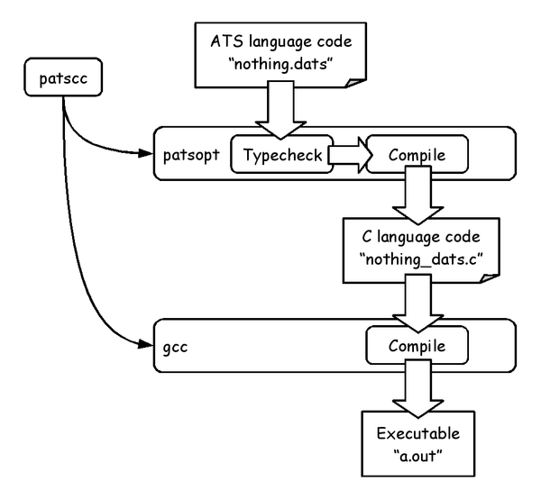

======================
"Hello, world!" on ATS
======================

ATS compiler is needed to run ATS program.
In other words, ATS language doesn't have interpreter such like OCaml language.
We try to compile some simple ATS program on this chapter, before learn full-featured ATS programming.

ATS program to do nothing
=========================

What is the minimum program?
It's mostly a program has nothing without a empty main function.
Let's create such "ATS program to do nothing".

.. literalinclude:: code/helloworld/nothing.dats
   :language: ocaml
   :linenos:

This is the ATS program has a main function doing nothing.
Detail of the code is explained as following:

* Any ATS programs start at ``main0`` function
* Keyword ``implement`` defines a new function ``main0`` at the code
* ``main0`` function has been declared in ATS language implementation
* ``main0`` has no arguments and return value is ``void`` type
* The body of the ``main0`` function does nothing and return ``()``
* The ``()`` is the only value of ``void`` type

Compile and run it
==================

Let's compile the "ATS program to do nothing".
Save it as ``nothing.dats`` and run following commands:

.. literalinclude:: code/helloworld/nothing_compile.txt
   :language: shell
   :linenos:

An executable ``a.out`` is created by ATS compiler ``patscc``.
Of course, the executable prints nothing on console while running.

By the way, how does the ``patscc`` command work?

As in the figure, the ``patscc`` internally calls two commands.

The first command is ``patsopt`` that compile ATS language code to C language,
while the ``patsopt`` does typecheck the ATS code and reports type errors.
The compilation ATS to C is aborted, if typechecking found some type errors.

The second command is ``gcc`` that is familiar to everyone.
C language code created by ``patsopt`` is compiled to executable by the ``gcc`` command.

Print character string on console
=================================

We learn how to use ``patscc`` command in the previous sub chapter.
Let's try "Hello, world!" program.

.. literalinclude:: code/helloworld/helloworld.dats
   :language: ocaml
   :linenos:

This code includes following new items:

* ``val`` defines binding between name and value
* The ``val`` at the code binds function return value of the function ``println!`` as ``void`` value
* ``println!`` is a special keyword that prints the argument on console and return ``void`` value

Then, the code prints the character string ``"Hello, world!"`` on console.

.. literalinclude:: code/helloworld/helloworld_compile.txt
   :language: shell
   :linenos:

This result may sound strange for a beginner of functional programming who has already learned imperative programming.
Conceptually, what happens at run-time in a call-by-value language such as ATS is following:

1. The expression ``println! "Hello, world!"`` is evaluated to the value ``()``, while it prints the character string ``"Hello, world!"`` on console
2. ``val`` creates a bind between ``()`` at left side of ``=`` and the result value of the expression ``println! "Hello, world!"``
3. The function ``main0`` is evaluated and does nothing
